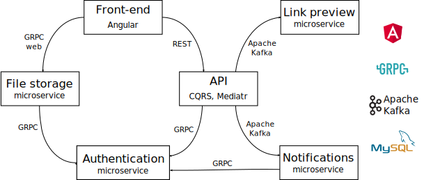

# 💬LetsTalk Chat App💬 @ back-end

🔔 Please, also see the [front-end repository](https://github.com/evgenii-petukhov/LetsTalk.Angular.App) 🙏

[Live demo](https://chat.epetukhov.cyou/)
## Description
The idea behind this project is to demonstrate that 
* I'm be able to create modern ASP.NET Core applications
* I understand the main principles of microservice architecture and event-driven development
* I know basic approaches of work with Apache Kafka
* I can deploy .NET applications on Linux
## Architecture

The back-end implements microservice architecture. There are a few microservices, such as
* **Authentication microservice** generates and validates JWT tokens
* **Notification microservice** sends notifications to the Angular application via SignalR
* **Link preview microservice** processes links inside messages and generates a preview

The API and the Notification microservice communicate with the Authentication microservice via GRPC.

The API, the LinkPreview, and the Notification microservice communicate with each other via Apache Kafka.

## Deployment
This is an instant messaging service with authentication via social media, such as Facebook. The service allows users to send text messages and share links. 

The back-end can be deployed on Linux. For this you need to make the following steps
* Clone the repository
* [Install dotnet](https://learn.microsoft.com/en-us/dotnet/core/install/linux-ubuntu)
* Install and [configure nginx](https://learn.microsoft.com/en-us/aspnet/core/host-and-deploy/linux-nginx?view=aspnetcore-7.0&tabs=linux-ubuntu) as reverse proxy
* Set up SSL certificates. I prefer using Certbot + Let's Encrypt.
* Register microservices as Linux daemons