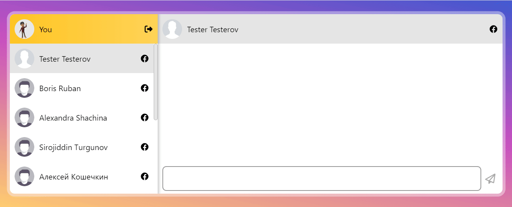

# LetsTalk Chat App @ back-end

🔔 Please also see the [front-end repository](https://github.com/evgenii-petukhov/LetsTalk.Angular.App) 🙏

🔴 [Live demo](https://chat2.epetukhov.cyou/)

## Description

LetsTalk is an instant messaging service with social media authentication (e.g., Facebook). Users can send text messages, images, and share links.

This project showcases my technical skills for potential IT recruiters, employers, and clients. It demonstrates that:

- I can:
  - Design event-driven system architectures
  - Use cloud services such as AWS SNS/SQS, S3, Lambda, DocumentDB, etc.
  - Create single-page web applications with Angular
  - Implement reactive state management with NgRx Store in Angular applications
  - Implement caching with both Redis and the MemoryCache class
- I understand:
  - The basic principles of the OpenAPI Specification
  - Microservice communication patterns and protocols, such as gRPC
  - The main principles of microservice architecture and event-driven development, with experience in Apache Kafka
  - Domain-driven design data consistency aspects ([see my article about DDD](https://www.linkedin.com/pulse/how-i-practiced-ddd-principles-ignoring-them-evgenii-petukhov/) on LinkedIn)

## Architecture

The front-end is an Angular single-page application using NgRx for reactive state management.

The back-end implements a microservice, event-driven architecture. Depending on the system configuration, it uses Apache Kafka or AWS SNS/SQS as an event broker. The table below describes each microservice:

| Microservice name | Protocol                    | Description                                                                                                                    |
| ----------------- | --------------------------- | ------------------------------------------------------------------------------------------------------------------------------ |
| Chat API          | REST                        | Responsible for sending messages and account management                                                                        |
| Authentication    | gRPC                        | Generates and validates JSON Web Tokens                                                                                        |
| Notification      | Apache Kafka or AWS SNS/SQS | Sends notifications about new messages to the front-end via SignalR                                                            |
| Link preview      | Apache Kafka or AWS SNS/SQS | Decorates messages with a website's name and a picture preview in the cloud by calling AWS Lambda, if a message contains links |
| File storage      | gRPC                        | Saves avatars and images uploaded by users in the cloud (AWS S3) and serves them when requested                                |
| Image processing  | Apache Kafka or AWS SNS/SQS | Generates image previews in the cloud by calling AWS Lambda; uses [SkiaSharp](https://github.com/mono/SkiaSharp)               |

Chat API supports both SQL and NoSQL databases, depending on the system configuration. Supported databases include:

- MySQL
- MongoDB
- Azure CosmosDB for MongoDB
- AWS DocumentDB

## Deployment

The back-end can be deployed on Linux. To do so, follow these steps:

- Clone the repository
- [Install .NET](https://learn.microsoft.com/en-us/dotnet/core/install/linux-ubuntu)
- Install and [configure Nginx](https://learn.microsoft.com/en-us/aspnet/core/host-and-deploy/linux-nginx?view=aspnetcore-7.0&tabs=linux-ubuntu) as a reverse proxy
- Set up SSL certificates (I recommend Certbot + Let's Encrypt)
- Register microservices as Linux daemons
