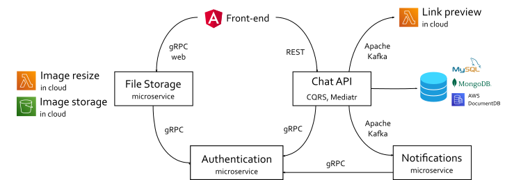

# 💬LetsTalk Chat App💬 @ back-end

🔔 Please, also see the [front-end repository](https://github.com/evgenii-petukhov/LetsTalk.Angular.App) 🙏

🔴 [Live demo](https://chat.epetukhov.cyou/)
## Description
This is an instant messaging service with authentication via social media, such as Facebook. The service allows users to send text messages and share links. 

This project is a showcase of my technical skills and talent for potential IT recruiters, employers, customers, etc. It demonstrates that I am able to
* create a single-page web application with Angular
* implement reactive state management with NgRx store in Angular applications
* understand the basic principles of the OpenAPI Specification
* understand microservice communication patterns and protocols, such as GRPC
* understand the main principles of microservice architecture, event-driven development, and experienced in using Apache Kafka
## Architecture

The front-end is an Angular single-page application which uses NgRx for reactive state management.
The back-end implements microservice architecture. The table below describes each ot them.

| Microservice name | Protocol | Description |
| ----------- | ----------- | ----------- |
| Chat API | REST | Responsible for sending messages and account management |
| Authentication | GRPC | Generates and validates JSON Web Tokens |
| Notification | Apache Kafka, SignalR | Sends out notifications about new messages |
| Link preview | Apache Kafka | Decorates messages with a website's name and a picture preview, if a message contains links |
| File storage | GRPC Web | Saves a user's avatar on the file system, serves avatars by request |
## Deployment
This is an instant messaging service with authentication via social media, such as Facebook. The service allows users to send text messages and share links. 

The back-end can be deployed on Linux. For this you need to make the following steps
* Clone the repository
* [Install dotnet](https://learn.microsoft.com/en-us/dotnet/core/install/linux-ubuntu)
* Install and [configure nginx](https://learn.microsoft.com/en-us/aspnet/core/host-and-deploy/linux-nginx?view=aspnetcore-7.0&tabs=linux-ubuntu) as reverse proxy
* Set up SSL certificates. I prefer using Certbot + Let's Encrypt.
* Register microservices as Linux daemons